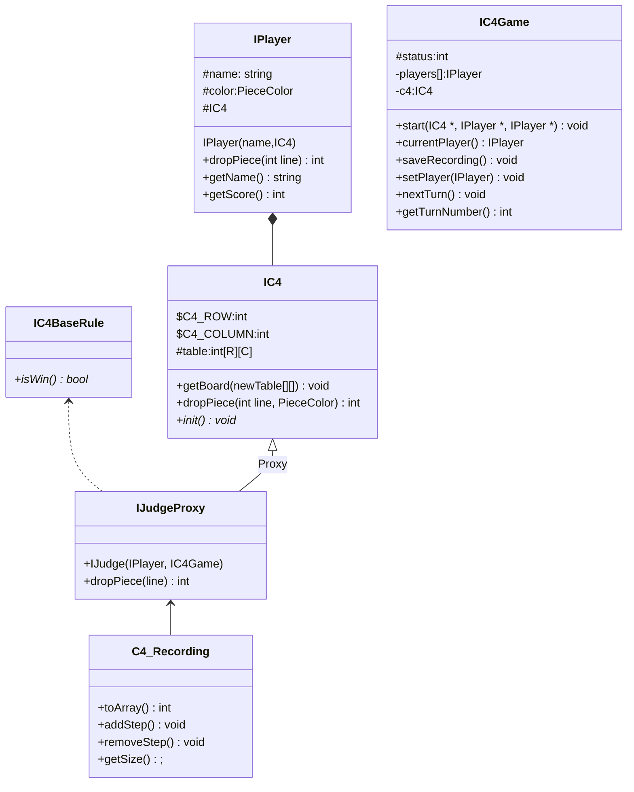
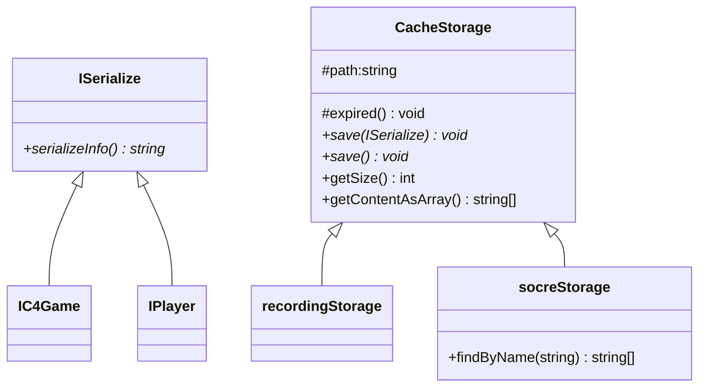
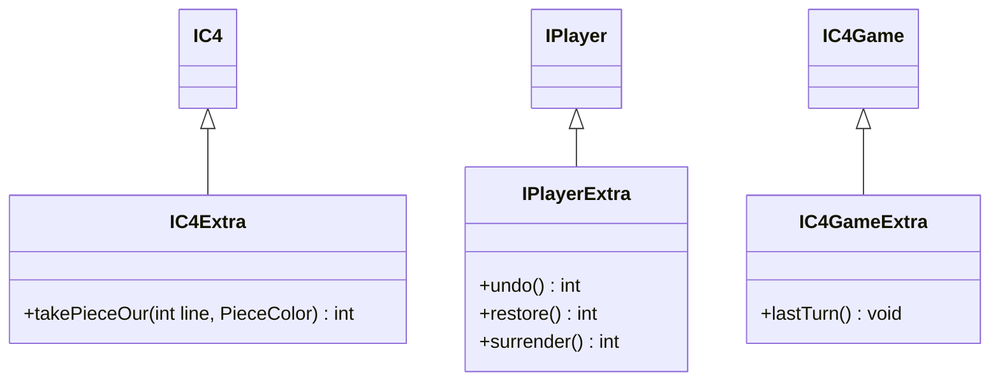
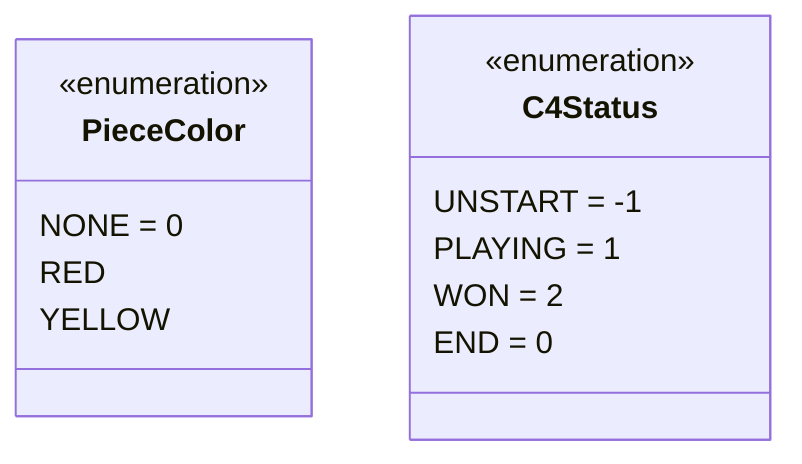
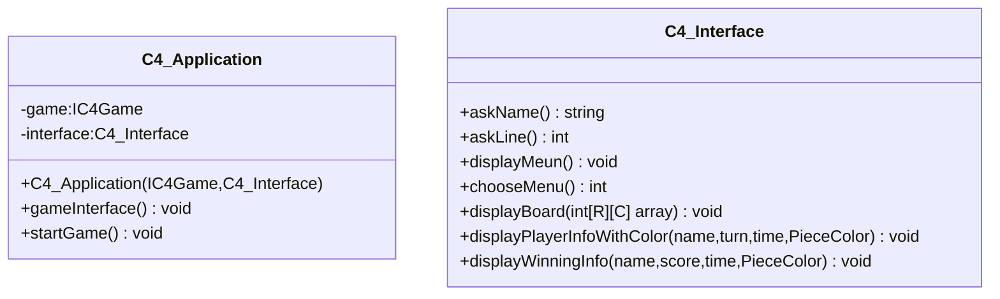

# C4 - Class Diagram

Created: November 7, 2022 5:17 PM
Created By: Microzenas
Last Edited By: Microzenas
Last Edited Time: March 31, 2023 11:40 PM
Stakeholders: Microzenas, Yezhi Wu
Status: In Progress

# Core

`IJudgeProxy`: Design for Proxy Patterns. Proxy IC4Game Class

Advantage: Use IOC (Inversion of Control) design to proxy `DropPiece` function.  

CODE: [https://github.com/microzen/connect4/blob/dev/core/c4/c4_judge.cpp](https://github.com/microzen/connect4/blob/dev/core/c4/c4_judge.cpp)

# File Storage

`CacheStorage`: Because `UserLogin`, `RecordingList`, and `ScoreList` will spend IO, `CacheStorage` will save time for IO reading and writing.

`ISerialize`: `IC4Game` and `Player` information will be stored after the game.  `CacheStrorage` should not care who it is. Save Function just wants to know what info should be stored.

Advantage: **Low Coupling**, Design an Interface `ISerialize` for information that needs to store. 

For example, this game needs to store login information every day. Now `Login` class inherits `ISerialize` and implements `serializeInfo()` function. Finally, login info can be stored by `Save(ISerialize)`.

# Extra Function (2.0)

# Base

# Interface (Input/Output)

