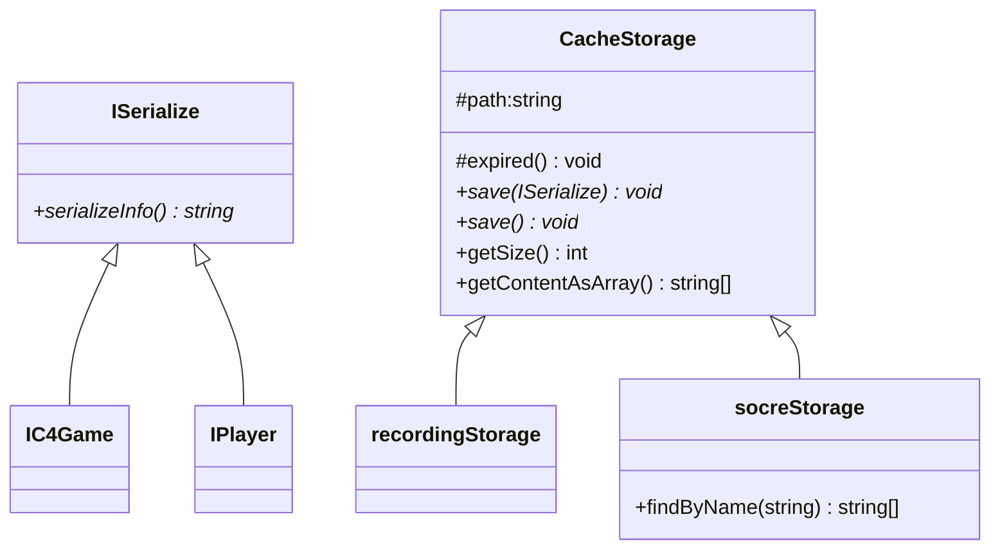

# File Cache Storage

Created: November 12, 2022 6:39 PM
Created By: Microzenas
Last Edited By: Microzenas
Last Edited Time: November 12, 2022 6:43 PM
Stakeholders: Microzenas, Yezhi Wu
Status: In Progress

# Using

```cpp
CacheStorage *storage = new CacheStorage("test.txt");
  int size = storage->getSize();
  cout << size << endl;

  std::string *array = storage->getContentAsArray();
  return 0;
  for (size_t i = 0; i < size; i++) {
    cout << array[i] << endl;
  }
```

# Diagram

