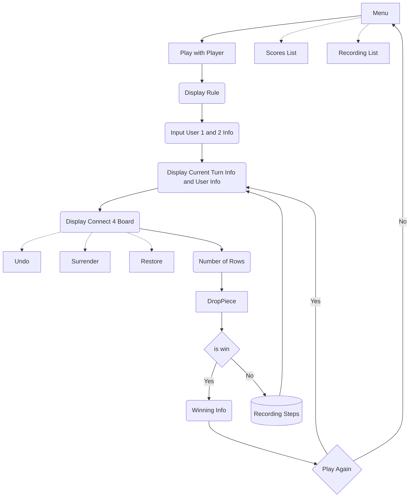
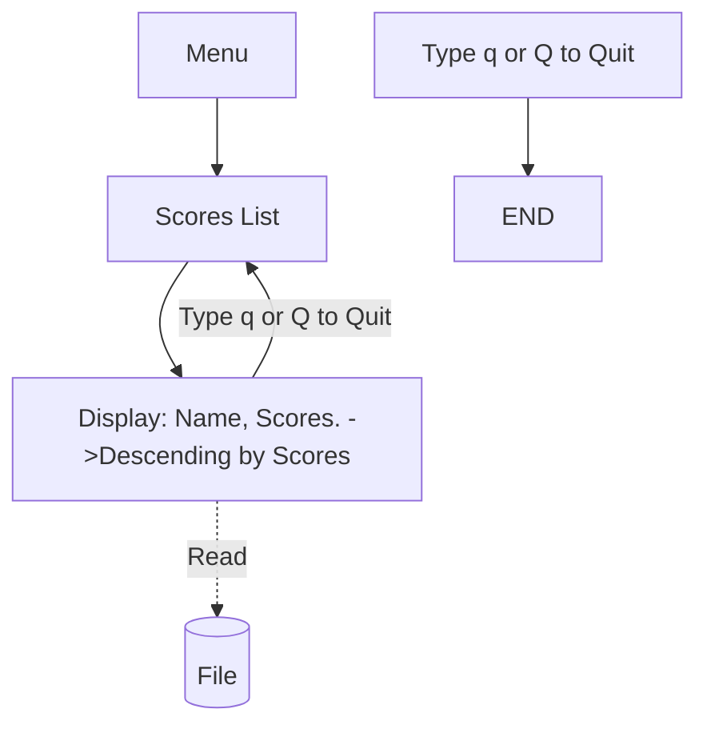
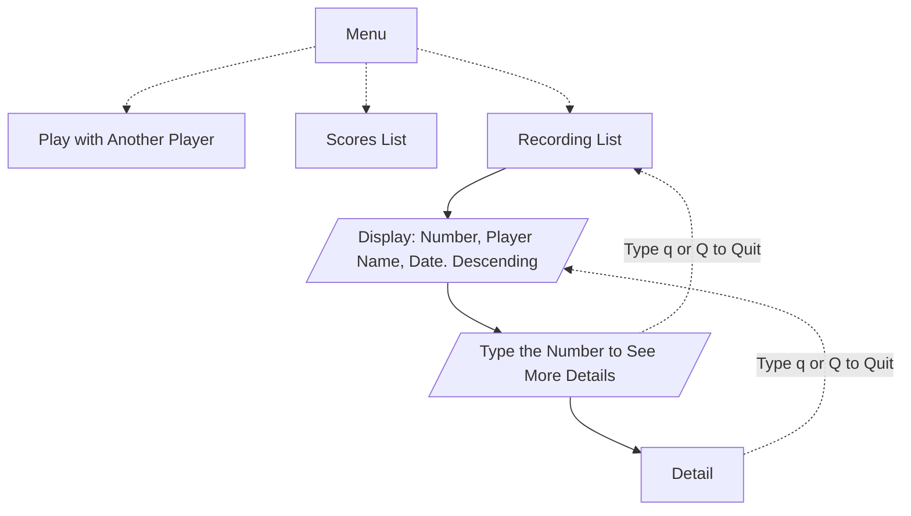

# Flowchart

Created: October 24, 2022 12:09 PM
Created By: Yezhi Wu
Last Edited By: Regina
Last Edited Time: November 19, 2022 8:04 PM
Stakeholders: Regina, Yezhi Wu, Microzenas
Status: In Progress
Type: Project Kickoff 🚀

# LOG

- Drop Play with Computer - resultantly dropped to simplify project development - November 1, 2022

# Interface

## Play with Another Player and Computer

## Scores List

## Recording List

