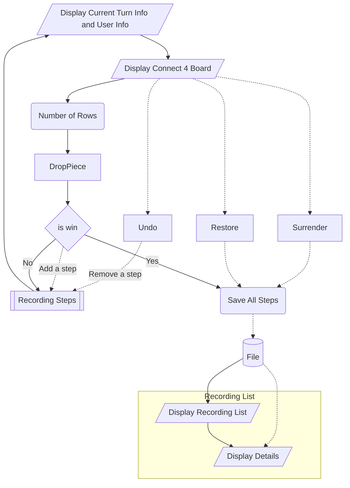

# Game’s Flow Details

Created: October 24, 2022 8:38 PM
Created By: Microzenas
Last Edited By: Microzenas
Last Edited Time: November 8, 2022 4:06 PM
Stakeholders: Yezhi Wu, Regina, Microzenas
Status: Archived
Type: Coding, Flowchart

# FlowChart

