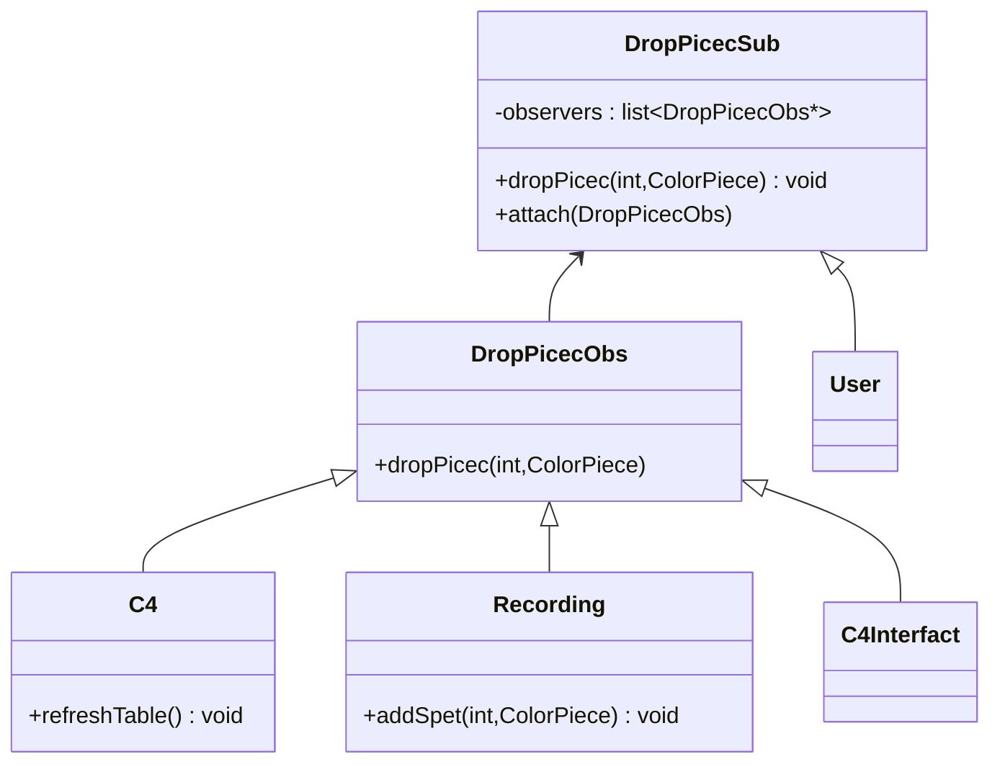

# Observer Of Dropping Action

Created: October 26, 2022 8:12 PM
Created By: Microzenas
Last Edited By: Microzenas
Last Edited Time: November 8, 2022 4:05 PM
Status: Drop

`DEOPPED`

# Description

Depend on [User Actions Sequence Diagrams](User%20Actions%20Sequence%20Diagrams%2059e5153185da4b71b8d6c8184a99b530.md) 

I design to use Observer Pattern 

# Doc of Observer

[Observer in C++](https://refactoring.guru/design-patterns/observer/cpp/example)