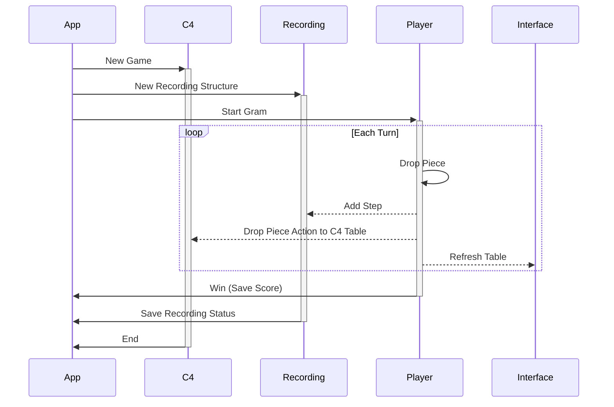

# User Actions Sequence Diagrams

Created: October 26, 2022 7:21 PM
Created By: Microzenas
Last Edited By: Microzenas
Last Edited Time: November 12, 2022 6:41 PM
Stakeholders: Yezhi Wu, Microzenas
Status: In Progress

